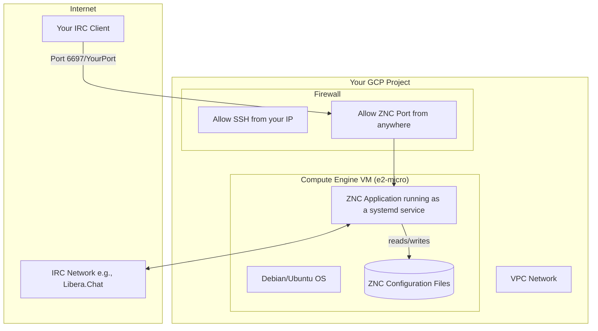

Here’s the architectural guidance for setting up a robust and cost-effective ZNC instance on GCP.

### 1. Understanding the "Why": Your Goal and the GCP Fit

Before diving into the technical steps, let's align your goal with the platform's strengths.

* **Your Core Need:** You need a lightweight, "always-on" server with a stable internet connection to run the ZNC application. The application itself has minimal CPU and RAM requirements but needs persistence for its configuration and logs.
* **GCP's Value:** GCP's infrastructure is built for reliability and its pay-per-use model is ideal for this scenario. For a small, personal project like ZNC, the primary goal is **cost optimization**, which we can achieve perfectly using the GCP Free Tier. This approach provides a reliable home for your application without requiring you to manage physical hardware.

---

### 2. Architectural Blueprint: ZNC on Compute Engine

We will use a single **Compute Engine VM instance** as the foundation. This is GCP's Infrastructure-as-a-Service (IaaS) offering, giving you a virtual machine that you have full control over. This is preferable to serverless options like Cloud Run or the overhead of Google Kubernetes Engine (GKE) for a simple, stateful application like ZNC.

The architecture is straightforward:



---

### 3. Step-by-Step Deployment Guide

Here is a practical, actionable guide to get you up and running. These commands use the `gcloud` CLI, the standard tool for managing GCP resources.

#### **Step 1: Create the Free Tier VM Instance**

First, we'll create an `e2-micro` VM. The Free Tier includes one of these instances per month in specific US regions (`us-west1`, `us-central1`, `us-east1`). We'll use `us-west1` as an example.

```bash
# Set your project ID
gcloud config set project YOUR_PROJECT_ID

# Create the e2-micro VM instance
gcloud compute instances create znc-bouncer \
    --project=YOUR_PROJECT_ID \
    --zone=us-west1-a \
    --machine-type=e2-micro \
    --network-interface=network-tier=STANDARD,subnet=default \
    --image-family=debian-11 \
    --image-project=debian-cloud \
    --boot-disk-size=10GB \
    --boot-disk-type=pd-balanced
```
* `--machine-type=e2-micro`: This is the specific instance type included in the **GCP Free Tier**.
* `--image-family=debian-11`: We're using a standard, lightweight Debian Linux image.

#### **Step 2: Configure Networking and Firewall**

For security, we'll create a firewall rule that only opens the port ZNC will listen on. We'll also reserve a static IP address to make it easier to connect your IRC client (note: a static IP has a small monthly cost, see the cost section below).

```bash
# Reserve a static IP address for your VM
gcloud compute addresses create znc-ip --region=us-west1
gcloud compute instances add-access-config znc-bouncer --address=znc-ip --zone=us-west1-a

# Create a firewall rule to allow traffic to your ZNC port
# Replace 6697 with the port you plan to use for ZNC.
gcloud compute firewall-rules create allow-znc \
    --network=default \
    --allow=tcp:6697 \
    --source-ranges=0.0.0.0/0 \
    --target-tags=znc-bouncer

# Add the network tag to your VM so the firewall rule applies
gcloud compute instances add-tags znc-bouncer --tags=znc-bouncer --zone=us-west1-a
```

**Security Best Practice:** The default SSH port (22) is open to the world in the default VPC. For better security, consider creating a more restrictive rule that only allows SSH from your home or work IP address.

#### **Step 3: Install and Configure ZNC**

Now, connect to your new VM and install ZNC.

```bash
# SSH into your VM
gcloud compute ssh znc-bouncer --zone=us-west1-a

# Once inside the VM, switch to a non-root user for ZNC
sudo adduser zncuser
sudo su - zncuser

# Install ZNC
sudo apt-get update && sudo apt-get install znc -y

# Run the ZNC configuration generator
znc --makeconf
```
Follow the on-screen prompts from `znc --makeconf`. When it asks for the listener port, use the one you opened in the firewall (e.g., `6697`).

#### **Step 4: Ensure Reliability (Run as a Service)**

To ensure ZNC starts automatically if the VM reboots, we'll create a `systemd` service file.

```bash
# As the root user on your VM (exit from zncuser)
sudo nano /etc/systemd/system/znc.service
```

Paste the following into the file. This assumes you created a user named `zncuser`.

```ini
[Unit]
Description=ZNC - An advanced IRC Bouncer
After=network-online.target

[Service]
User=zncuser
ExecStart=/usr/bin/znc -f
Restart=always

[Install]
WantedBy=multi-user.target
```

Now, enable and start the service:
```bash
sudo systemctl enable znc.service
sudo systemctl start znc.service
sudo systemctl status znc.service # Verify it's running
```

---

### 4. Cost Optimization and Analysis

* **VM Instance:** By using the `e2-micro` instance in a qualifying US region, the cost for the virtual machine itself is **$0**. The free tier covers one `e2-micro` instance, 30 GB of standard persistent disk, and 1 GB of network egress per month. Our 10GB disk is well within this limit.
* **Static IP Address:** An unused static IP address incurs a small cost. A used (attached) static IP address costs approximately **$2-3 per month**. This is a trade-off for the convenience of having a permanent address for your bouncer. If you are okay with updating your client's IP after a reboot, you can skip reserving a static IP to keep costs at zero.
* **Data Egress:** The 1 GB of free egress network traffic per month is more than enough for typical IRC usage.

---

### 5. Anti-Patterns to Avoid

* **⚠️ Don't use a large VM.** A common mistake is to provision a much larger machine than needed. An `e2-micro` is more than sufficient for ZNC and keeps it free.
* **⚠️ Don't open all ports.** Never create a firewall rule that opens all ports (`0-65535`) to the world (`0.0.0.0/0`). Only expose the specific port ZNC requires.
* **⚠️ Don't run ZNC manually in a shell.** If you don't run ZNC as a service (`systemd`), it will stop as soon as you close your SSH session or the VM reboots, defeating the purpose of a bouncer.